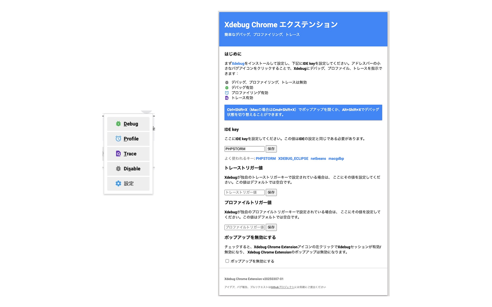

Xdebugを開始する君(Xdebug trigger tool for Google Chrome)
===============================

PHPの定番デバッグツールである[Xdebug](http://xdebug.org/)の起動をトリガーするために必要なCookieをワンクリックで設定することができます。

Fork from
---------

This extension is a fork of [mydogger's](https://github.com/mydogger/xdebug-helper-for-chrome) and [mac-cain13's](https://github.com/mac-cain13/xdebug-helper-for-chrome) repositories.

Created by
----------

This fork was created by uzulla ([zishida@gmail.com](mailto:zishida@gmail.com)).

Hotkeys
-------
Alt+Shift+X (Cmd+Shift+X on Mac) opens the popup, or toggles the debugging state when popup disabled.

License
-------
The code of this project is licensed under the MIT license.

